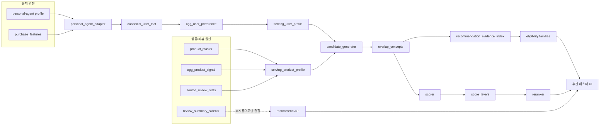
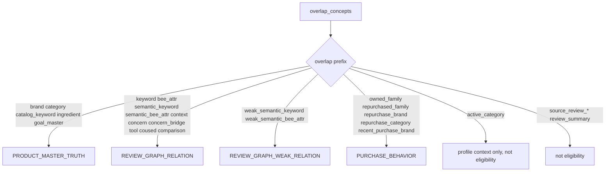
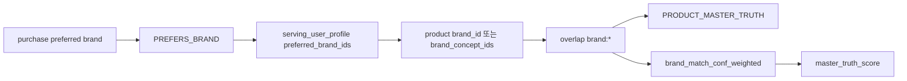
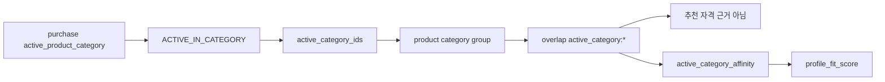
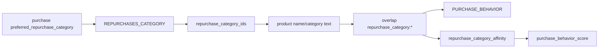
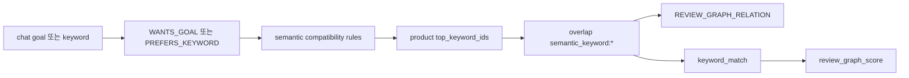
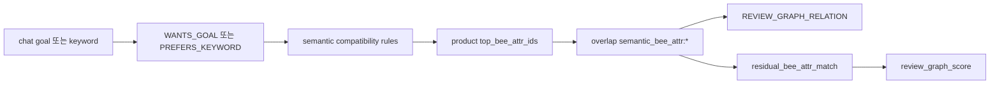
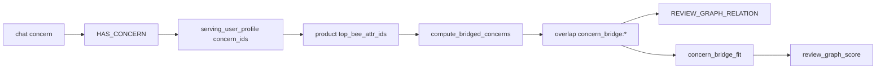
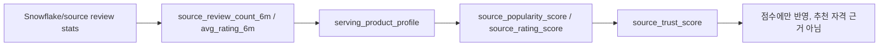

# 추천 신호 흐름 정리

최종 확인일: 2026-06-23

이 문서는 추천에 사용되는 신호가 원천 필드에서 시작해 GraphRapping의
레이어를 거치며 어떻게 후보 근거, 점수 feature, 점수 layer, UI 설명으로
이어지는지 정리한 문서다.

목적은 검토 가능성이다. 어떤 신호 흐름이 이상해 보이면, 어느 단계에서
생성되거나 승격되는지 바로 짚을 수 있어야 한다.

## 현재 기준 데이터

로컬 웹 API에서 dense golden fixture를 로드했을 때 기준값:

- 리뷰: 906개
- 서빙 상품: 32개
- 서빙 유저: 6명
- 그래프 신호: 2767개

중요한 현재 동작:

- `ACTIVE_IN_CATEGORY`는 `PREFERS_CATEGORY`와 분리되어 있다.
- `ACTIVE_IN_CATEGORY`는 `profile_fit_score` 아래의 약한
  `active_category_affinity`로만 반영된다.
- `ACTIVE_IN_CATEGORY`만으로는 상품이 추천 후보 자격을 얻지 못한다.
- `source_review_*` 통계는 source trust 점수로만 쓰이며, 추천 자격 근거가
  되지 않는다.
- `review_summary_sidecar`는 API/UI 표시용으로 붙지만, 현재 후보 생성이나
  점수에는 쓰지 않는다.

## 전체 흐름



## 유저 신호 변환

유저 원천 필드는 `src/user/adapters/personal_agent_adapter.py`에서 fact로
변환되고, `agg_user_preference`로 집계된 뒤 `serving_user_profile`에
요약된다.

| 원천 필드 | 유저 edge | scope 처리 | 서빙 필드 | 주요 downstream 사용 |
| --- | --- | --- | --- | --- |
| `basic.skin_type` | `HAS_SKIN_TYPE` | global | `skin_type` | 제품 concern 긍/부정과 결합해 `skin_type_fit` |
| `basic.skin_tone` | `HAS_SKIN_TONE` | global | `skin_tone` | 현재 추천 점수에는 미사용, 보관/표시용 |
| `basic.skin_concerns` | `HAS_CONCERN` | global | `concern_ids`, `scoped_preference_ids` | 리뷰 concern 직접 매칭 / concern bridge |
| `purchase_analysis.preferred_brand` | `PREFERS_BRAND` | global | `preferred_brand_ids` | 상품 브랜드 매칭 |
| `purchase_analysis.preferred_skincare_brand` | `PREFERS_BRAND` | `skincare` | `preferred_brand_ids`, `scoped_preference_ids` | 스킨케어 범위 브랜드 매칭 |
| `purchase_analysis.preferred_makeup_brand` | `PREFERS_BRAND` | `makeup` | 동일 | 메이크업 범위 브랜드 매칭 |
| `purchase_analysis.preferred_bodycare_brand` | `PREFERS_BRAND` | `bodycare` | 동일 | 바디 범위 브랜드 매칭 |
| `purchase_analysis.preferred_hair_brand` | `PREFERS_BRAND` | `haircare` | 동일 | 헤어 범위 브랜드 매칭 |
| `purchase_analysis.preferred_perfume_brand` | `PREFERS_BRAND` | `fragrance` | 동일 | 향수 범위 브랜드 매칭 |
| `purchase_analysis.active_product_category` | `ACTIVE_IN_CATEGORY` | global | `active_category_ids` | 약한 활동 카테고리 affinity |
| `purchase_analysis.preferred_repurchase_category` | `REPURCHASES_CATEGORY` | global | `repurchase_category_ids` | 상품명/카테고리 text와 재구매 카테고리 매칭 |
| `chat.ingredients.preferred` | `PREFERS_INGREDIENT` | global | `preferred_ingredient_ids` | 상품 성분 truth 매칭 |
| `chat.ingredients.avoid` | `AVOIDS_INGREDIENT` | global | `avoided_ingredient_ids` | hard filter |
| `chat.ingredients.allergy` | `AVOIDS_INGREDIENT` | global | `avoided_ingredient_ids` | 더 높은 confidence의 hard filter |
| `chat.face.skin_concerns` | `HAS_CONCERN` | `skincare` | `concern_ids`, `scoped_preference_ids` | 스킨케어 범위 concern 매칭 / bridge |
| `chat.face.skincare_goals` | `WANTS_GOAL` | `skincare` | `goal_ids`, `scoped_preference_ids` | 제품 효능 truth 매칭 / semantic review 매칭 |
| `chat.face.preferred_texture` | `PREFERS_BEE_ATTR` + `PREFERS_KEYWORD` | `skincare` | `preferred_bee_attr_ids`, `preferred_keyword_ids` | 정확/semantic 리뷰 매칭, catalog keyword |
| `chat.hair.hair_concerns` | `HAS_CONCERN` | `haircare` | `concern_ids`, `scoped_preference_ids` | 헤어 범위 concern 매칭 / bridge |
| `chat.hair.haircare_goals` | `WANTS_GOAL` | `haircare` | `goal_ids`, `scoped_preference_ids` | 헤어 범위 goal 매칭 |
| `chat.hair.preferred_texture` | `PREFERS_BEE_ATTR` + `PREFERS_KEYWORD` | `haircare` | 동일 | 헤어 범위 제형/키워드 매칭 |
| `chat.body.body_concerns` | `HAS_CONCERN` | `bodycare` | `concern_ids`, `scoped_preference_ids` | 바디 범위 concern 매칭 / bridge |
| `chat.body.bodycare_goals` | `WANTS_GOAL` | `bodycare` | `goal_ids`, `scoped_preference_ids` | 바디 범위 goal 매칭 |
| `chat.body.preferred_texture` | `PREFERS_BEE_ATTR` + `PREFERS_KEYWORD` | `bodycare` | 동일 | 바디 범위 제형/키워드 매칭 |
| `chat.scalp.scalp_concerns` | `HAS_CONCERN` | `haircare` | `concern_ids`, `scoped_preference_ids` | 두피 concern 매칭 |
| `chat.scalp.scalpcare_goals` | `WANTS_GOAL` | `haircare` | `goal_ids`, `scoped_preference_ids` | 두피 goal 매칭 |
| `chat.makeup.makeup_concerns` | `HAS_CONCERN` | `makeup` | `concern_ids`, `scoped_preference_ids` | 메이크업 concern 매칭 |
| `chat.makeup.makeup_goals` | `WANTS_GOAL` | `makeup` | `goal_ids`, `scoped_preference_ids` | 메이크업 goal 매칭 / semantic review 매칭 |
| `chat.makeup.preferred_texture` | `PREFERS_BEE_ATTR` + `PREFERS_KEYWORD` | `makeup` | 동일 | 메이크업 제형/키워드 매칭 |
| `chat.makeup.preferred_finish` | `PREFERS_KEYWORD` | `makeup` | `preferred_keyword_ids`, `scoped_preference_ids` | 메이크업 finish 키워드 / semantic / catalog keyword |
| `chat.makeup.color_preference` | `PREFERS_KEYWORD` | `makeup` | `preferred_keyword_ids`, `scoped_preference_ids` | 색상 키워드 / catalog keyword |
| `chat.scent.preferences` | `PREFERS_KEYWORD` | `fragrance` | `preferred_keyword_ids`, `scoped_preference_ids` | 향 선호 키워드 |
| `purchase_features.owned_product_ids` | `OWNS_PRODUCT` | global | `owned_product_ids` | 동일 SKU 억제, co-used product 매칭 |
| `purchase_features.owned_family_ids` | `OWNS_FAMILY` | global | `owned_family_ids` | 보유 family 억제 / penalty |
| `purchase_features.repurchased_family_ids` | `REPURCHASES_FAMILY` | global | `repurchased_family_ids` | 재구매 family affinity |
| `purchase_features.repurchased_brand_ids` | `REPURCHASES_BRAND` | global | `repurchase_brand_ids` | 재구매 브랜드 overlap / purchase loyalty |
| `purchase_features.recently_purchased_brand_ids` | `RECENTLY_PURCHASED` | global | `recent_purchase_brand_ids` | 최근 구매 브랜드 overlap / purchase loyalty |

## 상품/리뷰 신호 변환

상품 쪽 필드는 `serving_product_profile`을 통해 후보 생성과 점수 계산에
전달된다.

| 원천/서빙 필드 | 상품 쪽 의미 | 생성되는 candidate overlap | evidence family | score feature |
| --- | --- | --- | --- | --- |
| `brand_id`, `brand_concept_ids` | 상품마스터 브랜드 truth | `brand:*` | `PRODUCT_MASTER_TRUTH` | `brand_match_conf_weighted` |
| `category_id`, `category_concept_ids` | 상품마스터 카테고리 truth | 명시 `PREFERS_CATEGORY`가 있을 때만 `category:*` | `PRODUCT_MASTER_TRUTH` | `category_affinity` |
| `category_id`, `category_concept_ids` | 활동 카테고리 context | `active_category:*` | 없음 | `active_category_affinity` |
| `category_name`, `product_name`, `representative_product_name` | 상품마스터 taxonomy/name text | `catalog_keyword:*` | `PRODUCT_MASTER_TRUTH` | `catalog_keyword_match` |
| `category_name`, `product_name`, `representative_product_name` | 상품마스터 taxonomy/name text와 재구매 카테고리 | `repurchase_category:*` | `PURCHASE_BEHAVIOR` | `repurchase_category_affinity` |
| `ingredient_ids`, `ingredient_concept_ids` | 상품마스터 성분 truth | `ingredient:*` | `PRODUCT_MASTER_TRUTH` | `ingredient_match` |
| `ingredient_ids`, `ingredient_concept_ids` | 회피/알러지 체크 | `AVOIDS_INGREDIENT`와 충돌 시 hard filter | 없음 | 점수 계산 전 제외 |
| `main_benefit_ids`, `main_benefit_concept_ids` | 상품마스터 주요 효능 truth | `goal_master:*` | `PRODUCT_MASTER_TRUTH` | `goal_fit_master` |
| `variant_family_id` | 상품 family truth | `owned_family:*`, `repurchased_family:*` | `PURCHASE_BEHAVIOR` | family penalty/affinity 계열 |
| `top_keyword_ids` | 승격된 리뷰 키워드 그래프 신호 | `keyword:*` | `REVIEW_GRAPH_RELATION` | `keyword_match` |
| `top_keyword_ids` + semantic rule | 승격된 리뷰 키워드 semantic 매칭 | `semantic_keyword:*` | `REVIEW_GRAPH_RELATION` | strength 반영 `keyword_match` |
| `top_bee_attr_ids` | 승격된 리뷰 BEE 그래프 신호 | `bee_attr:*` | `REVIEW_GRAPH_RELATION` | `residual_bee_attr_match` |
| `top_bee_attr_ids` + semantic rule | 승격된 리뷰 BEE semantic 매칭 | `semantic_bee_attr:*` | `REVIEW_GRAPH_RELATION` | strength 반영 `residual_bee_attr_match` |
| optional weak keyword fields | long-tail 리뷰 키워드 신호 | `weak_semantic_keyword:*` | `REVIEW_GRAPH_WEAK_RELATION` | `review_graph_weak_relation_match` |
| optional weak BEE fields | long-tail 리뷰 BEE 신호 | `weak_semantic_bee_attr:*` | `REVIEW_GRAPH_WEAK_RELATION` | `review_graph_weak_relation_match` |
| `top_context_ids` | 리뷰 사용 맥락 신호 | `context:*` | `REVIEW_GRAPH_RELATION` | `context_match` |
| `top_concern_pos_ids` | 리뷰 concern positive 신호 | `concern:*` | `REVIEW_GRAPH_RELATION` | `concern_fit` |
| `top_bee_attr_ids` via concern bridge | BEE 기반 concern 추정 | `concern_bridge:*` | `REVIEW_GRAPH_RELATION` | `concern_bridge_fit` |
| `top_tool_ids` | 도구 co-mention 신호 | `tool:*` | `REVIEW_GRAPH_RELATION` | `tool_alignment` |
| `top_coused_product_ids` | 함께 쓰는 제품 그래프 신호 | `coused:*` | `REVIEW_GRAPH_RELATION` | `coused_product_bonus` |
| `review_count_30d` | 그래프 기준 제품 활동성 | overlap 없음 | 없음 | `freshness_boost` |
| `review_count_all` | 그래프 support count | overlap 없음 | 없음 | shrinkage 분모 |
| `source_review_count_6m`, `source_review_count_all` | 원천 리뷰량 | overlap 없음 | 없음 | `source_popularity_score` |
| `source_avg_rating_6m`, `source_avg_rating_all` | 원천 평점 | overlap 없음 | 없음 | `source_rating_score` |
| `review_summary_sidecar` | 요약 텍스트 / 성별 / 연령 / 상태 sidecar | overlap 없음 | 없음 | 현재 표시용 |

## Candidate Overlap에서 Evidence로



중요한 제외 규칙:

- `active_category:*`는 `PRODUCT_MASTER_TRUTH`가 아니다.
- `source_review_*`는 evidence family가 아니다.
- `review_summary_sidecar`는 evidence family가 아니다.

## Score Feature에서 Score Layer로

| score layer | 포함 feature |
| --- | --- |
| `master_truth_score` | `brand_match_conf_weighted`, `category_affinity`, `catalog_keyword_match`, `ingredient_match`, `goal_fit_master` |
| `review_graph_score` | `keyword_match`, `residual_bee_attr_match`, `context_match`, `concern_fit`, `concern_bridge_fit`, `tool_alignment`, `coused_product_bonus` |
| `review_graph_weak_evidence_score` | `review_graph_weak_relation_match` |
| `product_activity_score` | `freshness_boost` |
| `profile_fit_score` | `skin_type_fit`, `active_category_affinity` |
| `purchase_behavior_score` | `purchase_loyalty_score`, `novelty_bonus`, `exact_owned_penalty`, `owned_family_penalty`, `same_family_explore_bonus`, `repurchase_family_affinity`, `repurchase_category_affinity` |
| `source_trust_score` | `source_popularity_score`, `source_rating_score` |

## 주요 매칭 경로

### 명시 브랜드



### 활동 카테고리



### 상품마스터 text 기반 메이크업 키워드


### 재구매 카테고리



### 리뷰 그래프 키워드



### 리뷰 그래프 BEE



### Concern Bridge



### Source Trust



## 현재 관측된 Broad Semantic 케이스

`user_makeup_matte_50m`을 `skincare` 탭에서 추천할 때, 현재 dense fixture는
아래 경로를 여러 제품에서 반복 생성한다.

```text
active_category:concept:Category:skincare
semantic_bee_attr:performance:long_lasting:concept:BEEAttr:bee_attr_lasting_power|user_edge=WANTS_GOAL|strength=0.8500
```

이 의미는 다음과 같다.

- 유저 원천에는 `WANTS_GOAL:지속력`이 있다.
- semantic compatibility 규칙이 `지속력`을 리뷰 쪽
  `bee_attr_lasting_power`와 연결한다.
- 여러 스킨케어 제품의 `top_bee_attr_ids`에 `bee_attr_lasting_power`가 있다.
- 유저의 메이크업 전용 키워드인 `파우더`, `틴트`, `매트`, `세미매트`는
  `makeup` scope라서 스킨케어 탭 점수에 들어가지 않는다. 이것은 정상이다.
- 따라서 이 현상은 `PREFERS_CATEGORY` 누수가 아니다. 경쟁할 만한
  스킨케어 전용 근거가 적은 상태에서 broad review graph semantic match가
  반복되는 상태다.

반복되는 score shape:

| layer | 대표값 | 의미 |
| --- | ---: | --- |
| `master_truth_score` | 0 | 해당 유저/상품 조합에서 명시 product-master 매칭 없음 |
| `review_graph_score` | 0.0298 | `지속력 -> lasting_power` semantic BEE 매칭 반복 |
| `profile_fit_score` | 0.01 | 약한 활동 스킨케어 카테고리 context |
| `product_activity_score` | 0.04 | 리뷰 활동성 |
| `purchase_behavior_score` | 0.02 | 대부분 novelty, 강한 구매 이력 신호는 아님 |
| `source_trust_score` | 약 0.046-0.048 | 원천 리뷰량/평점 기반 tie-break |

## 현재 관측된 개선된 메이크업 케이스

`user_makeup_matte_50m`을 `makeup` 탭에서 추천할 때, 상위 틴트 제품은
아래 신호들을 함께 받는다.

```text
active_category:concept:Category:makeup
catalog_keyword:concept:Keyword:틴트
repurchase_category:concept:Category:틴트
semantic_bee_attr:performance:long_lasting:concept:BEEAttr:bee_attr_lasting_power|user_edge=WANTS_GOAL|strength=0.8500
```

이 경우 evidence family가 세 개로 나뉜다.

- `PRODUCT_MASTER_TRUTH`: `catalog_keyword:틴트`
- `REVIEW_GRAPH_RELATION`: `지속력 -> lasting_power`
- `PURCHASE_BEHAVIOR`: `repurchase_category:틴트`

이것이 의도한 더 풍부한 형태다. 리뷰 그래프 근거가 상품마스터나 구매행동을
대체하지 않고, 세 종류가 각각 별도 근거로 더해진다.

## 검토 체크리스트

아래 표를 보면서 이상해 보이는 경로를 찍어내면 된다.

| 검토할 경로 | 현재 계약 | 이상 신호 |
| --- | --- | --- |
| `ACTIVE_IN_CATEGORY -> active_category_affinity` | 약한 profile context only | `PREFERS_CATEGORY`, eligibility, `master_truth_score`로 나타나면 이상 |
| `PREFERS_CATEGORY -> category_affinity` | 명시 카테고리 선호에만 사용 | `active_product_category`에서 생성되면 이상 |
| `PREFERS_KEYWORD -> catalog_keyword` | 유저 키워드가 상품명/카테고리명에 직접 포함될 때만 사용 | full-text search처럼 동작하거나 scope를 무시하면 이상 |
| `REPURCHASES_CATEGORY -> repurchase_category` | 재구매 카테고리 값이 상품명/카테고리명에 직접 닿을 때 사용 | active category에서 발화되면 이상 |
| `WANTS_GOAL -> semantic_keyword/semantic_bee_attr` | rule 기반 semantic match | 규칙이 너무 넓거나 category-scope가 필요해 보이면 검토 |
| `HAS_CONCERN -> concern` | 직접 concern signal 매칭 | concern resolver가 무관한 고민을 합치면 이상 |
| `HAS_CONCERN -> concern_bridge` | BEE 기반 간접 concern 추정 | 근거 없는 의학적/피부 상태 claim처럼 보이면 이상 |
| `PREFERS_BEE_ATTR -> bee_attr` | generic을 제외한 정확 BEE attr 매칭 | generic formulation/texture axis만으로 후보 자격을 얻으면 이상 |
| `AVOIDS_INGREDIENT` | hard filter | 제외하지 않고 단순 감점만 하면 이상 |
| `source_review_*` | trust/tie-break only | 단독 추천 자격 근거가 되면 이상 |
| `review_summary_sidecar` | 표시용 only | 명시 결정 없이 후보 생성/점수를 바꾸면 이상 |

