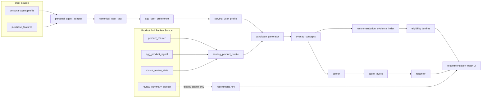
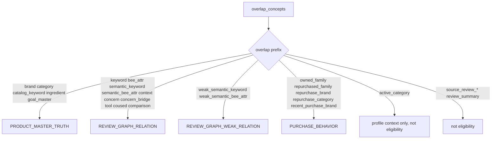
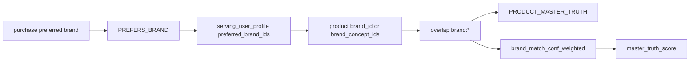
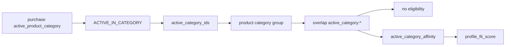
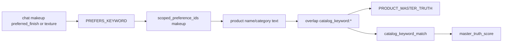
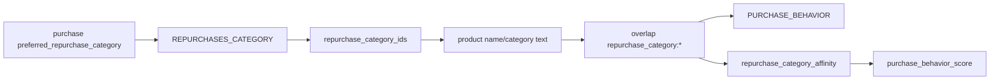
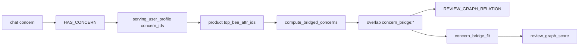
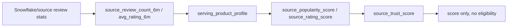

# Recommendation Signal Flow

Last verified: 2026-06-23

This document maps recommendation signals from source fields through
GraphRapping layers into candidate evidence, score features, score layers, and
UI explanations.

The goal is reviewability: if a signal looks conceptually wrong, it should be
easy to point to the row where it is created or promoted.

## Current Fixture Baseline

Dense golden fixture as loaded through the local web API:

- reviews: 906
- serving products: 32
- serving users: 6
- graph signals: 2767

Observed important behavior:

- `ACTIVE_IN_CATEGORY` is separated from `PREFERS_CATEGORY`.
- `ACTIVE_IN_CATEGORY` contributes only weak `active_category_affinity` under
  `profile_fit_score`.
- `ACTIVE_IN_CATEGORY` does not qualify a product by itself.
- `source_review_*` stats contribute source trust only and never eligibility.
- review summary sidecar is attached to API/UI output but is not used for
  candidate eligibility or score.

## End-To-End View



## User Signal Projection

Source fields are adapted in `src/user/adapters/personal_agent_adapter.py`, then
aggregated into `agg_user_preference`, then summarized into
`serving_user_profile`.

| Source field | User edge | Scope behavior | Serving field | Main downstream use |
| --- | --- | --- | --- | --- |
| `basic.skin_type` | `HAS_SKIN_TYPE` | global | `skin_type` | `skin_type_fit` via product concern pos/neg |
| `basic.skin_tone` | `HAS_SKIN_TONE` | global | `skin_tone` | stored/display only in current recommendation |
| `basic.skin_concerns` | `HAS_CONCERN` | global | `concern_ids`, `scoped_preference_ids` | review concern match / concern bridge |
| `purchase_analysis.preferred_brand` | `PREFERS_BRAND` | global | `preferred_brand_ids` | product brand match |
| `purchase_analysis.preferred_skincare_brand` | `PREFERS_BRAND` | `skincare` | `preferred_brand_ids`, `scoped_preference_ids` | scoped product brand match |
| `purchase_analysis.preferred_makeup_brand` | `PREFERS_BRAND` | `makeup` | same | scoped product brand match |
| `purchase_analysis.preferred_bodycare_brand` | `PREFERS_BRAND` | `bodycare` | same | scoped product brand match |
| `purchase_analysis.preferred_hair_brand` | `PREFERS_BRAND` | `haircare` | same | scoped product brand match |
| `purchase_analysis.preferred_perfume_brand` | `PREFERS_BRAND` | `fragrance` | same | scoped product brand match |
| `purchase_analysis.active_product_category` | `ACTIVE_IN_CATEGORY` | global | `active_category_ids` | weak active category affinity only |
| `purchase_analysis.preferred_repurchase_category` | `REPURCHASES_CATEGORY` | global | `repurchase_category_ids` | product catalog text repurchase category match |
| `chat.ingredients.preferred` | `PREFERS_INGREDIENT` | global | `preferred_ingredient_ids` | product ingredient truth match |
| `chat.ingredients.avoid` | `AVOIDS_INGREDIENT` | global | `avoided_ingredient_ids` | hard filter |
| `chat.ingredients.allergy` | `AVOIDS_INGREDIENT` | global | `avoided_ingredient_ids` | hard filter with higher confidence |
| `chat.face.skin_concerns` | `HAS_CONCERN` | `skincare` | `concern_ids`, `scoped_preference_ids` | scoped concern match / concern bridge |
| `chat.face.skincare_goals` | `WANTS_GOAL` | `skincare` | `goal_ids`, `scoped_preference_ids` | main benefit match / semantic review match |
| `chat.face.preferred_texture` | `PREFERS_BEE_ATTR` + `PREFERS_KEYWORD` | `skincare` | `preferred_bee_attr_ids`, `preferred_keyword_ids` | exact/semantic review match, catalog keyword |
| `chat.hair.hair_concerns` | `HAS_CONCERN` | `haircare` | `concern_ids`, `scoped_preference_ids` | scoped concern match / bridge |
| `chat.hair.haircare_goals` | `WANTS_GOAL` | `haircare` | `goal_ids`, `scoped_preference_ids` | scoped goal match |
| `chat.hair.preferred_texture` | `PREFERS_BEE_ATTR` + `PREFERS_KEYWORD` | `haircare` | same | scoped texture/keyword match |
| `chat.body.body_concerns` | `HAS_CONCERN` | `bodycare` | `concern_ids`, `scoped_preference_ids` | scoped concern match / bridge |
| `chat.body.bodycare_goals` | `WANTS_GOAL` | `bodycare` | `goal_ids`, `scoped_preference_ids` | scoped goal match |
| `chat.body.preferred_texture` | `PREFERS_BEE_ATTR` + `PREFERS_KEYWORD` | `bodycare` | same | scoped texture/keyword match |
| `chat.scalp.scalp_concerns` | `HAS_CONCERN` | `haircare` | `concern_ids`, `scoped_preference_ids` | scoped scalp concern match |
| `chat.scalp.scalpcare_goals` | `WANTS_GOAL` | `haircare` | `goal_ids`, `scoped_preference_ids` | scoped scalp goal match |
| `chat.makeup.makeup_concerns` | `HAS_CONCERN` | `makeup` | `concern_ids`, `scoped_preference_ids` | scoped makeup concern match |
| `chat.makeup.makeup_goals` | `WANTS_GOAL` | `makeup` | `goal_ids`, `scoped_preference_ids` | scoped makeup goal match / semantic review match |
| `chat.makeup.preferred_texture` | `PREFERS_BEE_ATTR` + `PREFERS_KEYWORD` | `makeup` | same | scoped makeup texture/keyword match |
| `chat.makeup.preferred_finish` | `PREFERS_KEYWORD` | `makeup` | `preferred_keyword_ids`, `scoped_preference_ids` | scoped finish keyword / semantic match / catalog keyword |
| `chat.makeup.color_preference` | `PREFERS_KEYWORD` | `makeup` | `preferred_keyword_ids`, `scoped_preference_ids` | scoped color keyword / catalog keyword |
| `chat.scent.preferences` | `PREFERS_KEYWORD` | `fragrance` | `preferred_keyword_ids`, `scoped_preference_ids` | scoped scent keyword |
| `purchase_features.owned_product_ids` | `OWNS_PRODUCT` | global | `owned_product_ids` | exact SKU suppression, co-used product match |
| `purchase_features.owned_family_ids` | `OWNS_FAMILY` | global | `owned_family_ids` | owned family suppression / penalty |
| `purchase_features.repurchased_family_ids` | `REPURCHASES_FAMILY` | global | `repurchased_family_ids` | repurchased family affinity |
| `purchase_features.repurchased_brand_ids` | `REPURCHASES_BRAND` | global | `repurchase_brand_ids` | repurchase brand overlap / purchase loyalty |
| `purchase_features.recently_purchased_brand_ids` | `RECENTLY_PURCHASED` | global | `recent_purchase_brand_ids` | recent brand overlap / purchase loyalty |

## Product And Review Signal Projection

Product-side fields are exposed through `serving_product_profile`.

| Source / serving field | Product-side meaning | Candidate overlap created | Evidence family | Score feature |
| --- | --- | --- | --- | --- |
| `brand_id`, `brand_concept_ids` | product master brand truth | `brand:*` | `PRODUCT_MASTER_TRUTH` | `brand_match_conf_weighted` |
| `category_id`, `category_concept_ids` | product master category truth | `category:*` only for explicit `PREFERS_CATEGORY` | `PRODUCT_MASTER_TRUTH` | `category_affinity` |
| `category_id`, `category_concept_ids` | active category context | `active_category:*` | none | `active_category_affinity` |
| `category_name`, `product_name`, `representative_product_name` | product master taxonomy/name text | `catalog_keyword:*` | `PRODUCT_MASTER_TRUTH` | `catalog_keyword_match` |
| `category_name`, `product_name`, `representative_product_name` | product master taxonomy/name text plus repurchase category | `repurchase_category:*` | `PURCHASE_BEHAVIOR` | `repurchase_category_affinity` |
| `ingredient_ids`, `ingredient_concept_ids` | product master ingredient truth | `ingredient:*` | `PRODUCT_MASTER_TRUTH` | `ingredient_match` |
| `ingredient_ids`, `ingredient_concept_ids` | avoid/allergy check | hard filter on `AVOIDS_INGREDIENT` | none | zero-out before scoring |
| `main_benefit_ids`, `main_benefit_concept_ids` | product master main benefit truth | `goal_master:*` | `PRODUCT_MASTER_TRUTH` | `goal_fit_master` |
| `variant_family_id` | product family truth | `owned_family:*`, `repurchased_family:*` | `PURCHASE_BEHAVIOR` | family penalty/affinity features |
| `top_keyword_ids` | promoted review keyword graph signal | `keyword:*` | `REVIEW_GRAPH_RELATION` | `keyword_match` |
| `top_keyword_ids` + semantic rules | promoted review keyword semantic match | `semantic_keyword:*` | `REVIEW_GRAPH_RELATION` | `keyword_match` with strength |
| `top_bee_attr_ids` | promoted review BEE graph signal | `bee_attr:*` | `REVIEW_GRAPH_RELATION` | `residual_bee_attr_match` |
| `top_bee_attr_ids` + semantic rules | promoted review BEE semantic match | `semantic_bee_attr:*` | `REVIEW_GRAPH_RELATION` | `residual_bee_attr_match` with strength |
| optional weak keyword fields | long-tail review keyword signal | `weak_semantic_keyword:*` | `REVIEW_GRAPH_WEAK_RELATION` | `review_graph_weak_relation_match` |
| optional weak BEE fields | long-tail review BEE signal | `weak_semantic_bee_attr:*` | `REVIEW_GRAPH_WEAK_RELATION` | `review_graph_weak_relation_match` |
| `top_context_ids` | review usage context signal | `context:*` | `REVIEW_GRAPH_RELATION` | `context_match` |
| `top_concern_pos_ids` | review concern-positive signal | `concern:*` | `REVIEW_GRAPH_RELATION` | `concern_fit` |
| `top_bee_attr_ids` via concern bridge | BEE-derived concern inference | `concern_bridge:*` | `REVIEW_GRAPH_RELATION` | `concern_bridge_fit` |
| `top_tool_ids` | tool co-mention signal | `tool:*` | `REVIEW_GRAPH_RELATION` | `tool_alignment` |
| `top_coused_product_ids` | co-used product graph signal | `coused:*` | `REVIEW_GRAPH_RELATION` | `coused_product_bonus` |
| `review_count_30d` | graph product activity | no overlap | none | `freshness_boost` |
| `review_count_all` | graph support count | no overlap | none | shrinkage denominator |
| `source_review_count_6m`, `source_review_count_all` | source review volume | no overlap | none | `source_popularity_score` |
| `source_avg_rating_6m`, `source_avg_rating_all` | source rating | no overlap | none | `source_rating_score` |
| `review_summary_sidecar` | summary text / gender / age / status sidecar | no overlap | none | currently display only |

## Candidate Overlap To Evidence



Important exclusions:

- `active_category:*` is not `PRODUCT_MASTER_TRUTH`.
- `source_review_*` is not an evidence family.
- `review_summary_sidecar` is not an evidence family.

## Score Feature To Layer

| Score layer | Features |
| --- | --- |
| `master_truth_score` | `brand_match_conf_weighted`, `category_affinity`, `catalog_keyword_match`, `ingredient_match`, `goal_fit_master` |
| `review_graph_score` | `keyword_match`, `residual_bee_attr_match`, `context_match`, `concern_fit`, `concern_bridge_fit`, `tool_alignment`, `coused_product_bonus` |
| `review_graph_weak_evidence_score` | `review_graph_weak_relation_match` |
| `product_activity_score` | `freshness_boost` |
| `profile_fit_score` | `skin_type_fit`, `active_category_affinity` |
| `purchase_behavior_score` | `purchase_loyalty_score`, `novelty_bonus`, `exact_owned_penalty`, `owned_family_penalty`, `same_family_explore_bonus`, `repurchase_family_affinity`, `repurchase_category_affinity` |
| `source_trust_score` | `source_popularity_score`, `source_rating_score` |

## Common Match Paths

### Explicit Brand



### Active Category



### Makeup Keyword From Product Master Text



### Repurchase Category



### Review Graph Keyword


### Review Graph BEE


### Concern Bridge



### Source Trust



## Current Observed Broad Semantic Case

For `user_makeup_matte_50m` in the `skincare` tab, the current dense fixture
still produces repeated paths:

```text
active_category:concept:Category:skincare
semantic_bee_attr:performance:long_lasting:concept:BEEAttr:bee_attr_lasting_power|user_edge=WANTS_GOAL|strength=0.8500
```

What this means:

- User source has `WANTS_GOAL:지속력`.
- Semantic compatibility maps `지속력` to review-side
  `bee_attr_lasting_power`.
- Multiple skincare products have `top_bee_attr_ids` containing
  `bee_attr_lasting_power`.
- The user's makeup-specific keywords such as `파우더`, `틴트`, `매트`,
  `세미매트` are scoped to `makeup`, so they correctly do not score in the
  skincare tab.
- The result is not a `PREFERS_CATEGORY` leak. It is a broad review graph
  semantic match with limited competing skincare-specific evidence.

Observed repeated score shape:

| Layer | Typical value | Meaning |
| --- | ---: | --- |
| `master_truth_score` | 0 | no explicit product-master match for this user/product pair |
| `review_graph_score` | 0.0298 | repeated `지속력 -> lasting_power` semantic BEE match |
| `profile_fit_score` | 0.01 | weak active skincare category context |
| `product_activity_score` | 0.04 | review activity |
| `purchase_behavior_score` | 0.02 | mostly novelty, not strong purchase history |
| `source_trust_score` | varies around 0.046-0.048 | source review volume/rating tie-break |

## Current Observed Improved Makeup Case

For `user_makeup_matte_50m` in the `makeup` tab, the top tint products now get:

```text
active_category:concept:Category:makeup
catalog_keyword:concept:Keyword:틴트
repurchase_category:concept:Category:틴트
semantic_bee_attr:performance:long_lasting:concept:BEEAttr:bee_attr_lasting_power|user_edge=WANTS_GOAL|strength=0.8500
```

This gives three evidence families:

- `PRODUCT_MASTER_TRUTH` from `catalog_keyword:틴트`
- `REVIEW_GRAPH_RELATION` from `지속력 -> lasting_power`
- `PURCHASE_BEHAVIOR` from `repurchase_category:틴트`

This is the intended richer shape: graph evidence does not replace product
master or purchase behavior; all three can add separate evidence.

## Review Checklist

Use this section to mark suspicious paths.

| Path to inspect | Current contract | Suspicious if |
| --- | --- | --- |
| `ACTIVE_IN_CATEGORY -> active_category_affinity` | weak profile context only | it appears as `PREFERS_CATEGORY`, eligibility, or `master_truth_score` |
| `PREFERS_CATEGORY -> category_affinity` | explicit category preference only | it is produced from `active_product_category` |
| `PREFERS_KEYWORD -> catalog_keyword` | direct user keyword in product name/category | it behaves like full-text search or ignores scope |
| `REPURCHASES_CATEGORY -> repurchase_category` | direct repurchase category in product name/category | it fires from active category instead of repurchase category |
| `WANTS_GOAL -> semantic_keyword/semantic_bee_attr` | rule-based semantic match | rule is too broad or should be category-scoped |
| `HAS_CONCERN -> concern` | direct concern signal match | concern resolver merges unrelated concerns |
| `HAS_CONCERN -> concern_bridge` | BEE-derived indirect concern | bridge makes unsupported clinical/skin claims |
| `PREFERS_BEE_ATTR -> bee_attr` | exact non-generic BEE attr match | generic formulation/texture axis qualifies by itself |
| `AVOIDS_INGREDIENT` | hard filter | it only down-ranks instead of filtering |
| `source_review_*` | trust/tie-break only | it qualifies a product by itself |
| `review_summary_sidecar` | display only | it changes candidate generation or score without explicit decision |

