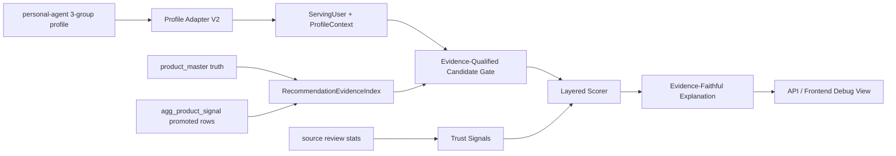

# Evidence-First Personalization Redesign Plan

> Status: approved and implementation started on 2026-06-19.

## Goal

GraphRapping recommendations must use all high-quality evidence without demoting product master truth. A product master brand/category/ingredient/main-benefit match is a first-class recommendation signal, on the same level as review-derived relation signals. The recommendation path must connect:

- Real user profile and purchase behavior from `/Users/amore/workplace/agent-aibc/persnal-agent`.
- Product master truth from GraphRapping: brand, category, ingredients, main benefits, product/family identity, canonical product/brand nodes.
- Review-derived graph relation signals promoted from the 906-review fixture and future full loads: BEE, keyword, concern, context, tool/co-use/comparison where available.
- Source review stats and review summaries as support/explanation, not primary eligibility evidence.

## Confirmed Current State

### Personal-Agent Profile Data

Measured files:

- `/Users/amore/workplace/agent-aibc/persnal-agent/src/personalization/data_store.py`
- `/Users/amore/workplace/agent-aibc/persnal-agent/src/personalization/signal_builder.py`
- `/Users/amore/workplace/agent-aibc/persnal-agent/src/personalization/recommend/profile_gate.py`
- `/Users/amore/workplace/agent-aibc/persnal-agent/src/personalization/recommend/service.py`
- `/Users/amore/workplace/agent-aibc/persnal-agent/PURCHASE_SUMMARY_RECOMMEND_USAGE.md`

Confirmed profile shape:

- `basic`: age, gender, skin type, skin tone, base skin concerns.
- `purchase_analysis`: active product categories, preferred brands by domain, brand ranks, current-use product summary, repurchase product summary, repurchase category ranks, seasonal products.
- `chat`: detailed face/hair/scalp/body/makeup/scent/color/ingredient preferences.

Important personal-agent behavior:

- Its recommendation service generates ES filters/keywords, not final product reranking.
- Rich purchase summaries are exposed to the LLM prompt with repurchase urgency, but rule-based fallback does not structurally use the product summaries.
- `SignalBuilder` supports bodycare, hair, and fragrance brand preferences.

### GraphRapping User Wiring

Measured files:

- `src/user/adapters/personal_agent_adapter.py`
- `src/loaders/user_loader.py`
- `src/ingest/purchase_ingest.py`
- `src/mart/build_serving_views.py`

Confirmed behavior:

- GraphRapping already accepts personal-agent's normalized 3-group profile.
- `purchase_events_by_user` can derive `OWNS_PRODUCT`, `OWNS_FAMILY`, `REPURCHASES_FAMILY`, `REPURCHASES_BRAND`, and `RECENTLY_PURCHASED`.
- The current adapter only imports `preferred_skincare_brand` and `preferred_makeup_brand`.
- It does not import `preferred_bodycare_brand`, `preferred_hair_brand`, `preferred_perfume_brand`, overall brand fallback, brand ranks, current-use product summary, repurchase product summary, seasonal products, or repurchase urgency.
- Product summary names such as `rprs_prd_nm` are not mapped back to GraphRapping `product_id`.

### GraphRapping Recommendation Wiring

Measured files:

- `src/web/server.py`
- `src/rec/candidate_generator.py`
- `src/rec/scorer.py`
- `src/rec/reranker.py`
- `src/rec/explainer.py`
- `configs/scoring_weights.yaml`
- `tests/test_corpus_promotion_baseline.py`

Confirmed behavior:

- `/api/recommend` sends every serving product ID into `generate_candidates_prefiltered`; there is no meaningful upstream narrowing.
- `generate_candidates` allows products with `overlap_concepts == []` to pass as valid candidates.
- `explore` mode allows category mismatch; `configs/scoring_weights.yaml` defines `category_penalty`, but the candidate/scoring path does not use it.
- `Scorer` adds source popularity, source rating, novelty, brand, category, ingredient, and other features even when there is no strong user-aligned evidence gate.
- `Explainer` only explains overlap concepts, so a high source/novelty score can produce a weak or empty explanation.
- Current 906-fixture promoted serving baseline has graph signal coverage only on `top_bee_attr_ids` for 26 products and `top_keyword_ids` for 5 products in `kg_off`; concern/context/tool/co-use promoted fields are 0.

## Problem Breakdown

1. Profile coverage loss:
   GraphRapping throws away several real personal-agent fields before recommendation starts.

2. Product identity loss:
   Personal-agent purchase summaries have product names and timing, but GraphRapping does not resolve them to product master IDs/families.

3. Evidence eligibility missing:
   A product can be a recommendation candidate without any strong user-aligned evidence. The missing gate is not "review graph only"; it is "at least one first-class evidence family must justify the candidate."

4. Category/domain control too loose:
   `explore` mode currently means broad category drift rather than controlled adjacent exploration.

5. Source stats are over-promoted:
   Review counts and ratings are useful trust signals, but they currently help ranking even when the product has no product-master, review-graph, or purchase/personalization evidence.

6. Explanation contract is weaker than ranking:
   Some score contributors are not represented as explanation paths, which hides why a product ranked.

## Target Architecture

## Core Decisions

### D1. Recommendation must be evidence-first, not graph-only.

Candidate eligibility must be established before scoring.

First-class eligible evidence paths:

- Product master truth matched to the user profile or purchase context:
  brand, category, ingredients, main benefits, product/family identity, canonical product/brand nodes.
- Review-derived relation evidence matched to the user profile:
  BEE attr, keyword, concern, context, tool, co-use, comparison.
- User current-use or repurchase behavior matched to product ID, family, brand, or category with domain compatibility.
- Mixed evidence across product master + review relation + purchase behavior increases confidence, but product master truth is not subordinate to review graph signals.

Non-eligible paths:

- Source review count or rating alone.
- Weak/unscoped evidence with no user profile alignment, for example a product's brand exists but the user has no matching brand preference or purchase behavior.
- Arbitrary category mismatch in explore mode.

### D2. Source stats become a tie-breaker only.

`source_review_count_6m`, `source_avg_rating_6m`, and review summary sidecar data remain useful, but only after candidate eligibility is true.

### D3. Personal-agent profile is the canonical real-user input.

GraphRapping should not maintain a separate synthetic user profile shape as the primary path. It should adapt personal-agent's 3-group profile into:

- Existing serving fields when schema-compatible.
- A new runtime `ProfileContext` for rich fields that do not belong in current DB columns.
- Provenance paths to show exactly which personal-agent field caused each signal.

### D4. No DB contract changes in the first implementation pass.

The current product/review/source stats DB wiring is stable and also consumed by AmoreSimulation. This redesign should first modify GraphRapping's utilization layer and tests. Persisted schema changes require a separate decision.

## Implementation Plan

### Phase 0: Baseline Lock And Data Fixture

Files:

- Add `docs/architecture/personal_agent_profile_graph_usage_2026_06_19.md`
- Add or update tests under `tests/`

Tasks:

- Export or load a small read-only sample of real personal-agent profiles without copying secrets from `.env`.
- Record available field coverage: basic, purchase summaries, purchase brands by domain, chat preferences, ingredient exclusions.
- Create a fixture manifest documenting user IDs, profile coverage, and purchase fields used for recommendation testing.
- Keep existing 906-review/product-master fixture as the product graph baseline.

Acceptance:

- We can run a local audit showing how many personal-agent users have current-use products, repurchase products, preferred brands by domain, concerns, goals, avoided ingredients, and texture/scent preferences.

### Phase 1: Profile Adapter V2

Files:

- Modify `src/user/adapters/personal_agent_adapter.py`
- Modify or add tests near `tests/test_user_adapter_semantics.py`, `tests/test_purchase_wiring.py`
- Add `src/user/profile_context.py` or equivalent runtime context module

Tasks:

- Import all category-specific purchase brands: skincare, makeup, bodycare, hair, perfume.
- Preserve source provenance for every adapted field.
- Convert active product category and repurchase category into category/domain-aware preferences.
- Add runtime extraction for:
  - `use_expected_product_summary`
  - `preferred_repurchase_product_summary`
  - `preferred_repurchase_category_rank`
  - `seasonal_product_summary`
  - product-level repurchase urgency
- Resolve `rprs_prd_nm` to GraphRapping product master IDs:
  - exact normalized product name first
  - representative product name second
  - source product ID if present
  - fuzzy match only as quarantined/low-confidence, never silent truth
- For high-confidence matches, produce runtime product/family behavior signals.

Acceptance:

- Body/hair/fragrance brand preferences survive adaptation.
- Purchase summary products can be traced to product IDs or explicit unresolved entries.
- No unresolved product name is silently treated as a product ID.

### Phase 2: Evidence Coverage Audit

Files:

- Inspect and modify only if needed:
  - `src/wrap/relation_projection.py`
  - `src/wrap/projection_registry.py`
  - `src/wrap/signal_emitter.py`
  - `src/mart/aggregate_product_signals.py`
  - `src/mart/build_serving_views.py`
- Add focused coverage tests.

Tasks:

- Measure per-stage counts for relation families:
  - extracted relation
  - canonical fact
  - signal emission
  - aggregate row
  - promoted serving field
- Explain why current promoted baseline has:
  - BEE attrs on 26 products
  - keywords on 5 products in `kg_off`
  - concern/context/tool/co-use on 0 products
- Do not lower promotion thresholds blindly.
- If relation signals are lost due to projection or canonical mapping, fix the mapping.
- If they are absent because the 906 fixture truly lacks enough support, expose that as low graph coverage and force recommendation fallback behavior.

Acceptance:

- Coverage report distinguishes "not present in source" from "lost in pipeline".
- Tests fail if promoted graph signal families unexpectedly disappear.

### Phase 3: Evidence-Qualified Candidate Gate

Files:

- Modify `src/rec/candidate_generator.py`
- Add `src/rec/recommendation_evidence_index.py`
- Add `src/rec/category_domain.py`
- Update `src/web/server.py`
- Add candidate gate tests.

Tasks:

- Build `RecommendationEvidenceIndex` from serving product profiles:
  - product master truth: brand, category, ingredient, main benefit, product/family identity.
  - review-derived relation signals: BEE attr, keyword, context, concern, tool, co-use, comparison.
  - source trust: kept separate, not part of eligibility.
- Add `CandidateEligibility` metadata:
  - `eligible: bool`
  - `eligibility_reasons`
  - `master_truth_paths`
  - `review_graph_paths`
  - `purchase_paths`
  - `rejection_reasons`
- Strict mode:
  - require domain/category compatibility when user domain is known.
  - require at least one first-class evidence path: product master truth, review relation evidence, or purchase behavior.
- Explore mode:
  - allow adjacent domains only through a configured category-domain map.
  - still require at least one first-class evidence path.
- Compare mode:
  - allow wider candidate set, but label weak evidence explicitly.
- Stop returning source-only or profile-unrelated products as normal recommendations.

Acceptance:

- Brand candidates pass when the brand preference is user-aligned and category/domain compatible; they must not be treated as weaker than review graph signals.
- Source-only candidates do not pass.
- Empty-evidence top results disappear from normal recommendation mode.
- Candidate count can be 0; that should produce a useful "no evidence-qualified candidate" response instead of arbitrary products.

### Phase 4: Layered Scoring

Files:

- Modify `src/rec/scorer.py`
- Modify `configs/scoring_weights.yaml`
- Modify `src/rec/reranker.py` only if needed
- Add scoring contract tests.

Tasks:

- Split score into explicit layers:
  - `eligibility_score`
  - `master_truth_score`
  - `review_graph_score`
  - `profile_fit_score`
  - `purchase_behavior_score`
  - `source_trust_score`
  - `diversity_adjustment`
- Apply source trust only when eligibility is true.
- Keep source trust low enough that it never rescues profile-unrelated products.
- Normalize final score for UI display while keeping raw layer details for debugging.
- Keep graph support shrinkage separate from source review volume.

Acceptance:

- A candidate with no product-master, review-graph, or purchase/personalization eligibility has final score 0 or is rejected.
- Source review count/rating only reorders already-qualified candidates.
- Explanation paths account for all meaningful positive score layers.

### Phase 5: Evidence-Faithful Explanation And UI

Files:

- Modify `src/rec/explainer.py`
- Modify `src/rec/hook_generator.py`
- Modify `src/web/server.py`
- Modify `src/static/app.js`

Tasks:

- Return recommendation reasons grouped by:
  - product master truth
  - review graph evidence
  - personal profile match
  - purchase behavior
  - source trust
- Add rejected-candidate debug view for local/frontend inspection.
- Make review summaries presentation-only unless a later decision promotes structured summary fields into ranking.
- Display "evidence-qualified" vs "fallback/no evidence-qualified candidate" clearly.

Acceptance:

- User can see which evidence families mattered for each recommendation: product master truth, review graph relations, purchase behavior, and source trust.
- If review graph evidence did not participate, API/UI says the recommendation is product-master/purchase-driven instead of pretending it is review-graph-driven.

### Phase 6: Evaluation Harness

Files:

- Add tests under `tests/`
- Add scripts under `scripts/` if useful
- Add audit doc under `docs/architecture/`

Tasks:

- Build golden scenarios from real personal-agent-style profiles:
  - sensitive/dry skincare
  - scalp or hair concern
  - body relief
  - makeup finish/texture preference
  - repurchase-due product/category
  - ingredient avoidance
- Assertions:
  - top recommendations are category/domain compatible.
  - top recommendations have product-master, review-graph, or purchase-behavior eligibility.
  - source-only recommendations are rejected.
  - brand/ingredient recommendations are accepted when they are user-aligned and domain-compatible.
  - avoided ingredients always hard-filter.
  - explanations include the evidence path that caused ranking.
- Add a manual audit script that prints top-N with all score layers and eligibility reasons.

Acceptance:

- Recommendation results are meaningful to a user, not just mechanically matched.
- Regression tests catch the exact failure mode observed in the current frontend.

## Multi-Angle Review

### Product Value

This redesign makes recommendations explainable as "because your profile says X and this product has product-master truth Y and/or review-derived relation Z", rather than "because source stats were high". Product master truth and review graph relations are both first-class reasons.

### Data Integrity

No source field should be silently dropped. Product master truth is canonical evidence, not a secondary helper. Fields that cannot be represented in the current serving schema are preserved in runtime context with provenance until a DB schema decision is made.

### Maintainability

Candidate gating, scoring, and explanation become separate stages. Each stage can be tested with small fixtures.

### Risk

The 906 fixture may have sparse promoted review-relation signals. If so, the correct behavior is to report low review-graph coverage and rely honestly on product-master/purchase evidence where available, not to fill recommendations with source-only matches.

### Compatibility

The first pass avoids changing the DB schema and avoids changing AmoreSimulation-facing contracts.

## Open Questions Before Implementation

- Should GraphRapping read real personal-agent profiles directly from that project's DB connection, or should we first use exported JSON snapshots for reproducible local tests?
- For current-use product summaries, should a high-confidence product-name match be treated as `OWNS_PRODUCT`, or should we keep it separate as runtime-only `CURRENTLY_USES_PRODUCT` until a DB schema decision?
- How strict should `explore` be for adjacent categories: same large domain only, or configured cross-domain bridges such as scalp-to-hair?

## Proposed Default Answers

- Use exported JSON snapshots first, then add direct DB read only after the contract is stable.
- Keep current-use product summaries runtime-only at first; also emit existing `OWNS_PRODUCT` fields only when the match is exact and clearly purchase-derived.
- Explore should allow same domain and explicitly configured adjacent domains only.

## Implementation Order

1. Baseline fixture and audit report.
2. Profile Adapter V2 and product-name resolution.
3. Evidence coverage audit.
4. Evidence-qualified candidate gate.
5. Layered scorer.
6. Evidence-faithful API/UI.
7. Golden scenario tests and manual audit report.

## Implementation Progress

Completed in the first implementation slice:

- Added `docs/architecture/personal_agent_profile_graph_usage_2026_06_19.md`.
- Added candidate evidence classification for product master truth, review graph
  relations, and purchase behavior.
- Updated normal recommendation candidate generation to reject source-only or
  profile-unrelated products.
- Kept `require_evidence=False` for tests/helpers that only validate hard
  filters, family detection, or low-level matching behavior.
- Expanded the personal-agent adapter to preserve bodycare, hair, perfume,
  overall purchase brands, basic concerns, body/scalp/makeup chat concerns and
  goals, texture, and scent shapes.
- Added high-confidence exact product summary resolution for current-use,
  repurchase, and seasonal purchase summaries.
- Exposed score layers for product master truth, review graph, profile fit,
  purchase behavior, and source trust.
- Exposed recommendation eligibility metadata through `/api/recommend` and the
  frontend.

Not yet completed:

- Per-stage review-relation coverage audit from relation extraction to promoted
  serving fields.
- Golden scenario evaluation using exported real personal-agent profiles.
