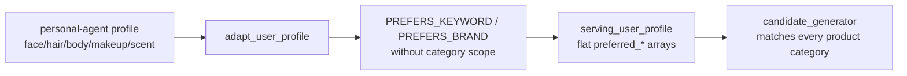
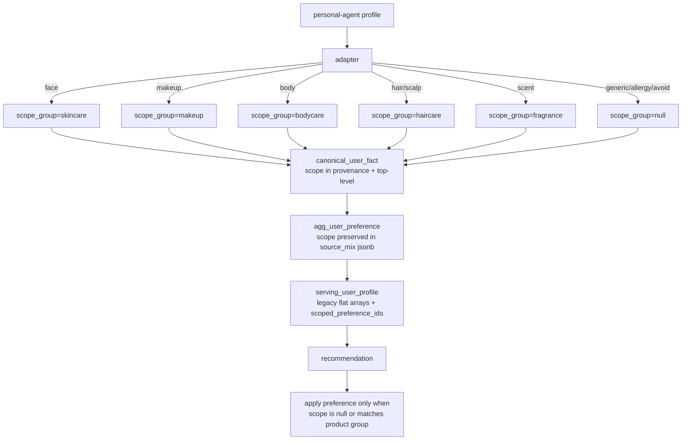
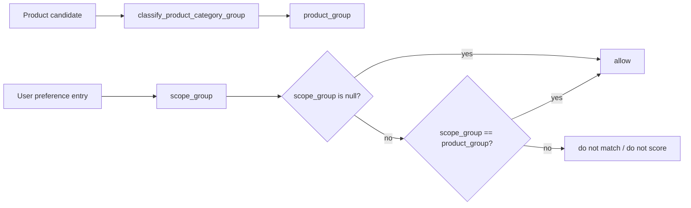

# Scoped User Preference Flow Design

Date: 2026-06-22

## Goal

GraphRapping recommendation must use product-master truth and review-graph
relations as peer evidence, while preserving where a user preference came from.
A makeup texture preference must not leak into skincare recommendation scoring,
and a hair/scalp concern must not be treated as a face-care preference unless
the profile source says it is global.

This design fixes the current loss point:



## Measured Current State

Code inspection on 2026-06-22 found:

- `src/user/adapters/personal_agent_adapter.py` maps all category-specific
  purchase brands into plain `PREFERS_BRAND`.
- Face, hair, body, makeup, and scent `preferred_texture`/scent values become
  plain `PREFERS_KEYWORD`.
- `src/user/canonicalize_user_facts.py` preserves neither source section nor
  recommendation category scope.
- `src/mart/aggregate_user_preferences.py` groups only by
  `(predicate, object_iri)`, so two scoped preferences for the same keyword
  collapse.
- `src/mart/build_serving_views.py` emits only flat arrays such as
  `preferred_keyword_ids`.
- `src/rec/candidate_generator.py` and `src/rec/semantic_compatibility.py`
  match those flat arrays against every product candidate.

## Target Flow



## Scope Contract

`scope_group` is the recommendation product group where the preference is valid.

| Source section | Scope |
| --- | --- |
| `purchase.preferred_skincare_brand` | `skincare` |
| `purchase.preferred_makeup_brand` | `makeup` |
| `purchase.preferred_bodycare_brand` | `bodycare` |
| `purchase.preferred_hair_brand` | `haircare` |
| `purchase.preferred_perfume_brand` | `fragrance` |
| `purchase.preferred_brand` | null/global |
| `chat.face.*` | `skincare` |
| `chat.makeup.*` | `makeup` |
| `chat.body.*` | `bodycare` |
| `chat.hair.*`, `chat.scalp.*` | `haircare` |
| `chat.scent.*` | `fragrance` |
| `chat.ingredients.avoid`, `chat.ingredients.allergy` | null/global hard filter |
| `basic.*` | null/global unless explicitly remapped later |

## Matching Rule



This rule applies to:

- `PREFERS_BRAND`
- `PREFERS_KEYWORD`
- `PREFERS_BEE_ATTR`
- `HAS_CONCERN`
- `WANTS_GOAL`
- `PREFERS_CONTEXT`
- `PREFERS_INGREDIENT`

Global hard filters such as `AVOIDS_INGREDIENT` stay global.
Category preference filtering remains group-aware through the existing
`preferred_category_ids` and `category_groups_for_values()` path.

## Serving Contract

`serving_user_profile` keeps existing arrays for compatibility:

- `preferred_brand_ids`
- `preferred_keyword_ids`
- `preferred_bee_attr_ids`
- `concern_ids`
- `goal_ids`

It also adds `scoped_preference_ids`:

```json
{
  "edge_type": "PREFERS_KEYWORD",
  "id": "concept:Keyword:매트",
  "weight": 0.8,
  "scope_group": "makeup",
  "source_sections": ["chat.makeup.preferred_texture"]
}
```

DB persistence needs `agg_user_preference.scope_group` because the same
`dst_node_id` can be valid in multiple product groups. Without that column, the
legacy primary key `(user_id, preference_edge_type, dst_node_id)` collapses
entries such as `concept:Keyword:크림` for skincare/bodycare/haircare.

Scope is also copied into `source_mix` so rows remain self-describing in audit
queries. The persisted `serving_user_profile` table gets a jsonb column
`scoped_preference_ids` so DB consumers and the local frontend use the same
serving contract.

## Product And Review Evidence Roles

Product-master truth stays first-class:

- brand
- category
- ingredients
- main benefits
- price/source stats as trust features

Review graph evidence stays first-class:

- promoted BEE attributes
- promoted keywords
- promoted concern/context/tool/co-use/comparison relations
- semantic compatibility with explicit value/polarity rules

The scope fix does not demote either source. It prevents user intent from being
applied to the wrong product group.

## Acceptance Criteria

- Dense golden frontend and API load 906 reviews, 32 products, and 6 users on
  the `dense_golden` fixture.
- A makeup-scoped `매트` or `파우더` preference cannot qualify a skincare product.
- A skincare-scoped `크림` preference cannot qualify a makeup product.
- A global avoid ingredient still filters every product group.
- Scope survives adapter -> canonical facts -> aggregate rows -> serving user
  profile.
- Legacy flat arrays remain populated so older consumers do not break.
